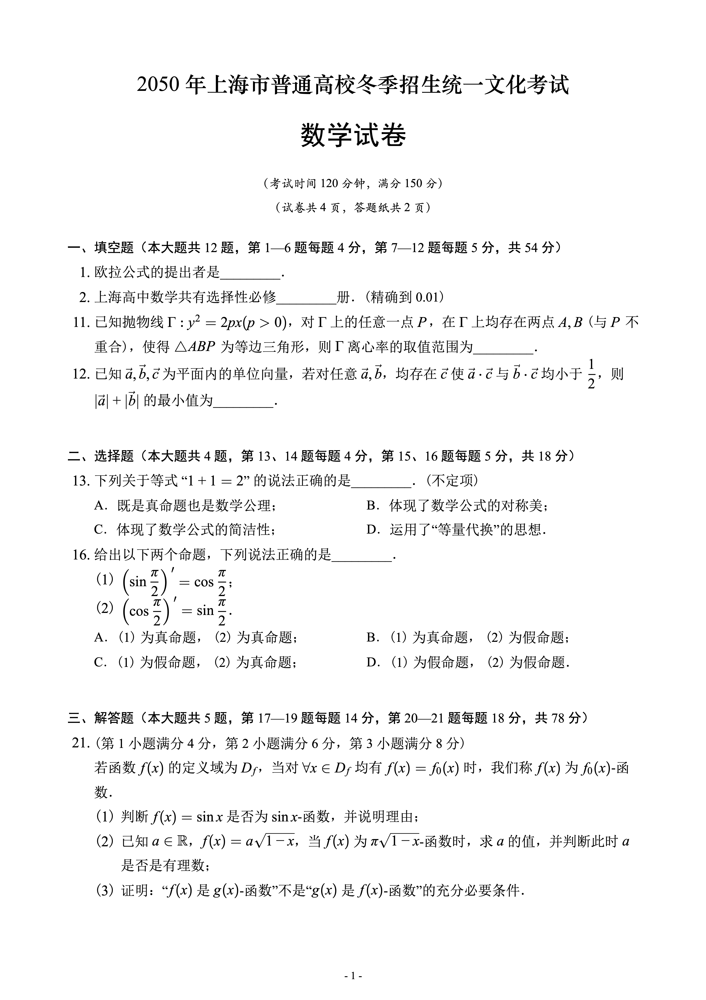
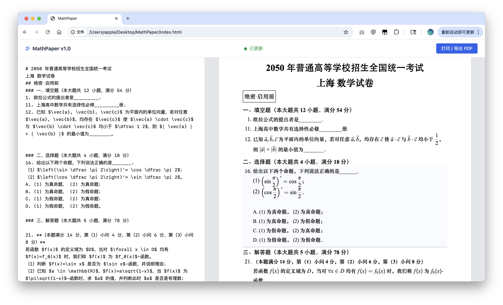

# 📐 MathPaper - 智能数学试卷排版系统

（Almost ~~everything~~50% by Gemini, except idea）

【2026.3.7 重大更新】重构代码，增加语法，更加贴合上海高考的排版同时也支持一定程度的风格个性化。

排版工作浩瀚复杂，不少功能实现难度大，如同不断贴补丁；目前版本做到与高考风格相似度 90% 左右，但受限于时间精力，不与高考完全一致，且可能带有一些本项目作者的排版习惯倾向而未向“完全复刻”妥协。

## 👀 排版效果预览

## 🌟 项目简介

MathPaper 是一个高效、所见即所得 (WYSIWYG) 的单文件 Web 排版工具，主要应用于个人数学题目收集排版。

## ✨ 核心特性

* **⚡ 稳定高效的 KaTeX 渲染：** 采用 Vue 组件隔离技术，完美解决了 KaTeX 直接操作 DOM 与 Vue 虚拟 DOM 之间的冲突，确保系统在复杂输入和频繁操作下仍保持稳定。左侧编辑后，右侧公式实时更新。
* **📃 智能分页与布局：** 实时监测内容高度，自动进行 A4 纸张分页。
    * **拖拽调整：** 拖动题目底部的蓝色手柄，精确控制题目下方留白。
    * **强制分页：** **双击**任何题目块，可在该题目之前插入强制分页符。
* **🖋️ 智能输入解析：** 简化您的输入，系统自动识别并转换标签：
    * `# 试卷标题`：自动识别为试卷标题。
    * `## 方块记号`：转化为带边框的小标题。
    * `### 小标题`：转化为黑体的小标题，一般用于大题前的文字说明。
    * `1. 题目内容`：自动识别为大题号。
    * `(1) 小题内容` 或 `（1）小题内容`：自动识别为大题号下的小题号。
    * 在 20260307 更新后，添加了更多支持的语法。
* **🖨️ 完美打印输出：** 专为打印和 PDF 导出优化。
* **🎨 风格完美复刻：** 通过对 KaTeX 进行神奇 CSS 微操，复刻接近上海高考风格的排版。

## 🛠️ 技术栈

* **核心框架：** Vue 3 (用于响应式数据绑定和组件化)
* **数学渲染：** KaTeX (用于高速、高质量的 LaTeX 公式渲染)
* **样式：** Tailwind CSS (用于 UI 布局) + 用户定制 CSS

## 🚀 如何使用

1.  **准备文件：** 项目下的 `index.html`。
2.  **打开浏览器：** 在 Chrome 或 Edge 中直接打开此 HTML 文件。
3.  **开始编辑：** 在左侧输入框中粘贴您的试卷内容。
4.  **调整与导出：** 在右侧预览区进行拖拽和双击微调，满意后点击 **"打印 / 导出 PDF"** 按钮即可获得成品。